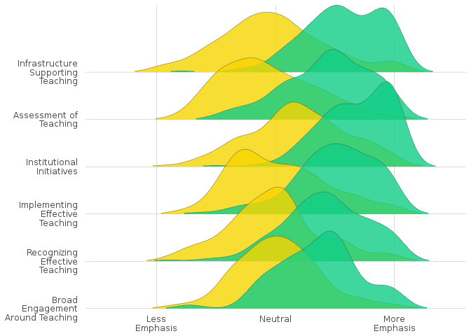
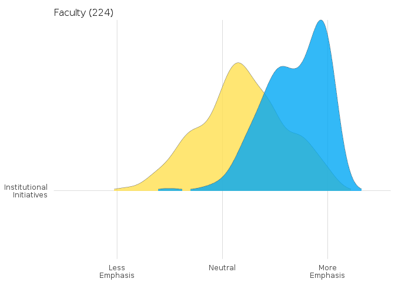
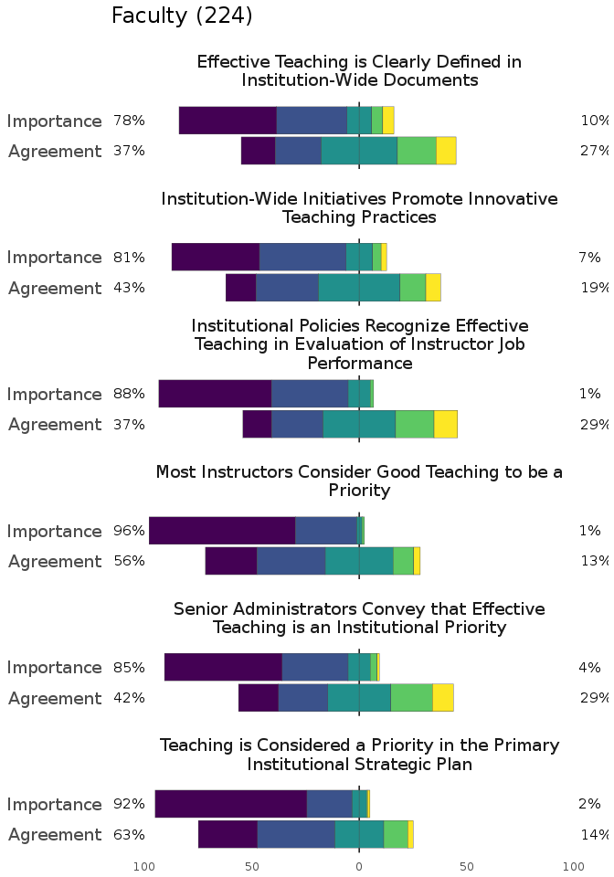

Teaching Culture Perception Survey (TCPS) Project
=================================================

The goal of tcps package is to provide functionality to tidy and visualize the results of running the teaching culture perception survey at an institution.

Installation
------------

You can install tcps from GitHub with:

``` r
# install.packages("devtools")
devtools::install_github("jkaupp/tcps")
```

Using this package
------------------

At this point, the survey data is provided to institutions by contacting the Project Committee. Data is provided to the instiution in the form of an SPSS file that contains all raw data, plus statistics and calculated levers. The `tidy_tcps` function would be used in this case to clean up the file for plotting and other downstream analysis. It is difficult to show here as the SPSS files are unavailble to be shared due to institutional ethics clearance.

However, to show the output for `tidy_tcps` and to illustrate the plotting functions, a simulated data set was created.

``` r

library(tcps)

data("tcps_sample")

head(tcps_sample)
#>    survey part_num      scale assessteach brengage impteach infrastruct
#> 1 Faculty        1  agreement    2.300445       NA 2.856109    3.793624
#> 2 Faculty        1 importance    3.485987       NA       NA    4.767556
#> 3 Faculty        2  agreement          NA       NA       NA          NA
#> 4 Faculty        2 importance    4.158180 3.456709 4.121237    3.966393
#> 5 Faculty        3  agreement          NA       NA       NA    3.195384
#> 6 Faculty        3 importance    3.490444 3.716041 3.992719    4.174280
#>   instinit teachrec Q6 Q7 Q8 Q9 Q10 Q11 Q12 Q13 Q14 Q15 Q16 Q17 Q18 Q19
#> 1       NA 3.313276  1  3  1  1  NA   1   4   1   5   4   3   5   1   5
#> 2 3.691987 3.365464  3  1  3  1   3   3   3   4   1   2   3   2  NA   4
#> 3       NA       NA NA NA  3  3   4   4   4   1   3  NA   2   4   3   4
#> 4 4.634086 4.001944  1  2  1  1   2   1   1   3   1   2   2   2   2   2
#> 5       NA       NA  2  1  4  4  NA   3  NA  NA   5  NA  NA   4   3  NA
#> 6       NA 3.332120  1  1  1  1  NA   3   2   4   2   1   3   3   2   2
#>   Q20 Q21 Q22 Q23 Q24 Q25 Q26 Q27 Q28 Q29 Q30 Q31 Q32 Q33 Q34 Q35 Q36 Q37
#> 1   3   3   4   3   3   5   1   1   3   1  NA   3   4  NA   3   3   3   3
#> 2   2   2   2   2   2   1   1   1   2   1  NA   3  NA   3   2   3   4   2
#> 3   3  NA   3   4   4   4   3   3   4  NA  NA  NA  NA  NA   4   4   3   3
#> 4   2   2   2   2   1   2   2   2   2   2   2   3   2   3   4   2   2   1
#> 5  NA  NA   3   3  NA   4   1   3   3   3   3   3   2   3  NA   3   3   4
#> 6   2   3   3   1   1   1   1   2   2   3   3   3   1   3   2   1   3   2
#>   Q38 Q39 Q40 Q41 Q42
#> 1   3   4   1   1   4
#> 2   3   3   2   3   3
#> 3  NA  NA   3   3  NA
#> 4   3   4   1   1   2
#> 5   2   1  NA   4   5
#> 6   4   3   2   3   2
```

Visualizations
==============

Ridgeline plots of levers
-------------------------

The primary visualization for the 6 levers in the survey is a [ridgeline plot](http://blog.revolutionanalytics.com/2017/07/joyplots.html) that illustrates the distribution of the lever scores for each respondent for both agreement and importance. The arguments to the function are: \* `x` = tidy tcps data \* `lever` = optional lever selection as a string \* `pal` = length two vector of RGB hex colors (pal\_one, pal\_two, pal\_three are supplied in the package) \* `aggregate` = boolean TRUE/FALSE. If TRUE, it aggregates responses across all surveys present in the data (faculty, staff, student). If false it presents as a grid for each survey.

``` r
lever_ridgeline(tcps_sample)
#> Picking joint bandwidth of 0.237
```



You plot a single ridgeline by using the shortname for the lever as a string. The shortnames and corresponding lever titles are available via `.levers`

``` r
lever_ridgeline(tcps_sample, lever = "instinit", pal = pal_two)
#> Picking joint bandwidth of 0.226
```



Plotting Scale Items
====================

The distributions of each question comprising a scale can also be visualized as a stacked bar chart, disaplying the percentage of responses in each category.

``` r
lever_scale(tcps_sample, "instinit")
```


