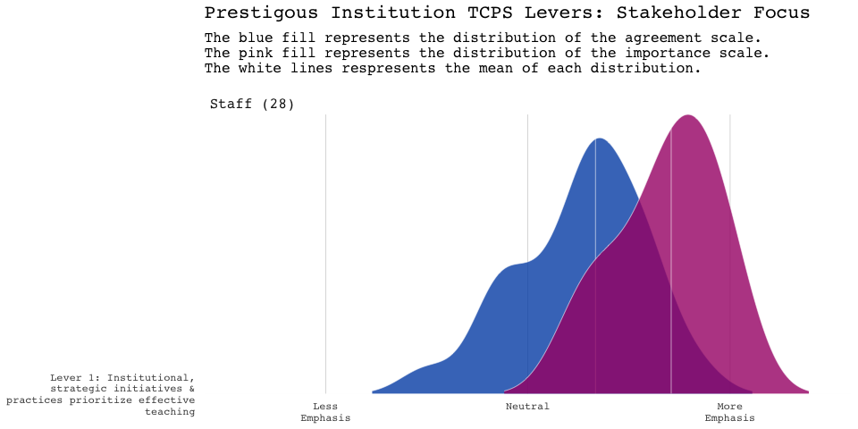
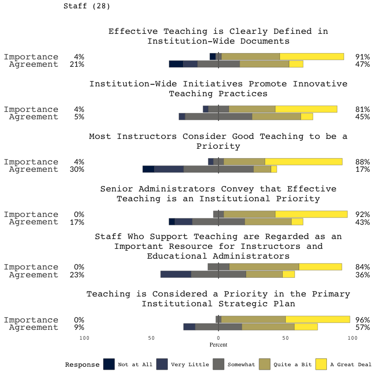

# Teaching Culture Perception Survey (TCPS) Project

The goal of tcps package is to provide functionality to tidy and
visualize the results of running the teaching culture perception survey
at an institution.

# Using the tcps package

The package is freely available and requires R to be installed as well.
R is a free open-source software available at
<https://www.r-project.org/>. It is a command line program, but there
are many high quality and free interactive development environments
(IDE) one can use. Rstudio <https://www.rstudio.com> is a highly
recommended IDE to download and install.

To recap:

1.  Download & Install R <https://www.r-project.org/>
2.  Download & Install RStudio <https://www.rstudio.com>
3.  Launch RStudio (which will start up an instance of R as well)

## Installation

You can install tcps from GitHub, by first installing and loading the
`devtools` package

``` r
install.packages("devtools")

devtools::install_github("jkaupp/tcps")
```

## Using this package

There is a vignette in the package that walks through the use of the
`tcps` package

``` r
vignette("using_the_tcps")
```

## Quick Features

### Importing your data

Reading in properly prepared output from survey platforms, and creating
the levers.

``` r
library(tcps)

# Load some sample data!
file <- tcps_sample("staff_sample.xlsx")

tcps_data <- tcps_read_excel(file)

head(tcps_data)
#> # A tibble: 6 x 42
#>   part_num scale survey lever1 lever1_q1 lever1_q2 lever1_q3 lever1_q4
#>      <int> <chr> <chr>   <dbl>     <dbl>     <dbl>     <dbl>     <dbl>
#> 1        1 agre… staff   NA           NA        NA        NA        NA
#> 2        1 impo… staff   NA           NA        NA        NA        NA
#> 3        2 agre… staff    3.33         4         4         4         3
#> 4        2 impo… staff   NA           NA        NA        NA        NA
#> 5        3 agre… staff   NA           NA        NA        NA        NA
#> 6        3 impo… staff    4.5          4         5         4         4
#> # … with 34 more variables: lever1_q5 <dbl>, lever1_q6 <dbl>,
#> #   lever2 <dbl>, lever2_q2 <dbl>, lever2_q3 <dbl>, lever2_q4 <dbl>,
#> #   lever2_q5 <dbl>, lever3 <dbl>, lever3_q1 <dbl>, lever3_q3 <dbl>,
#> #   lever3_q4 <dbl>, lever3_q5 <dbl>, lever3_q6 <dbl>, lever3_q7 <dbl>,
#> #   lever4 <dbl>, lever4_q1 <dbl>, lever4_q2 <dbl>, lever4_q3 <dbl>,
#> #   lever4_q4 <dbl>, lever4_q5 <dbl>, lever4_q6 <dbl>, lever5 <dbl>,
#> #   lever5_q1 <dbl>, lever5_q2 <dbl>, lever5_q3 <dbl>, lever5_q4 <dbl>,
#> #   lever5_q5 <dbl>, lever5_q6 <dbl>, lever6 <dbl>, lever6_q1 <dbl>,
#> #   lever6_q2 <dbl>, lever6_q3 <dbl>, lever6_q4 <dbl>, lever6_q6 <dbl>
```

### Visualizing Levers & Scales

Provides functions to visualize the TCPS
levers….

``` r
tcps_lever_ridgeline(tcps_data, name = "Prestigious Institution", lever = "lever1")
#> Picking joint bandwidth of 0.261
```



as well as functionality to visualize the scales/questions that comprise
the
lever.

``` r
tcps_lever_scale(tcps_data, choice =  "lever1", name = "Prestigious Institution")
```



## Summary Statistics

You can obtain simple summary statistics by scale, survey type, lever
and question.

``` r
tcps_summary_stats(tcps_data)
#> # A tibble: 10 x 42
#> # Groups:   scale, survey [2]
#>    scale survey measure lever1 lever1_q1 lever1_q2 lever1_q3 lever1_q4
#>    <chr> <chr>  <chr>    <dbl>     <dbl>     <dbl>     <dbl>     <dbl>
#>  1 agre… staff  mean     3.52      3.75      3.83      3.42      3.71 
#>  2 agre… staff  median   3.67      4         4         3         3.5  
#>  3 agre… staff  n       13         5         6         6         5    
#>  4 agre… staff  sd       0.638     0.989     1.52      1.10      0.999
#>  5 agre… staff  sem      0.177     0.442     0.622     0.449     0.447
#>  6 impo… staff  mean     4.37      4.5       4.44      4.46      4.23 
#>  7 impo… staff  median   4.42      4.5       5         5         4    
#>  8 impo… staff  n       13         4         5         3         4    
#>  9 impo… staff  sd       0.510     0.648     1.00      0.647     0.863
#> 10 impo… staff  sem      0.141     0.324     0.449     0.373     0.431
#> # … with 34 more variables: lever1_q5 <dbl>, lever1_q6 <dbl>,
#> #   lever2 <dbl>, lever2_q2 <dbl>, lever2_q3 <dbl>, lever2_q4 <dbl>,
#> #   lever2_q5 <dbl>, lever3 <dbl>, lever3_q1 <dbl>, lever3_q3 <dbl>,
#> #   lever3_q4 <dbl>, lever3_q5 <dbl>, lever3_q6 <dbl>, lever3_q7 <dbl>,
#> #   lever4 <dbl>, lever4_q1 <dbl>, lever4_q2 <dbl>, lever4_q3 <dbl>,
#> #   lever4_q4 <dbl>, lever4_q5 <dbl>, lever4_q6 <dbl>, lever5 <dbl>,
#> #   lever5_q1 <dbl>, lever5_q2 <dbl>, lever5_q3 <dbl>, lever5_q4 <dbl>,
#> #   lever5_q5 <dbl>, lever5_q6 <dbl>, lever6 <dbl>, lever6_q1 <dbl>,
#> #   lever6_q2 <dbl>, lever6_q3 <dbl>, lever6_q4 <dbl>, lever6_q6 <dbl>
```

## Reporting

There is also functions to produce a boilerplate word document report
(across all groups: Staff, Faculty and Students) simply by providing a
path to a directory where each prepared file resides.

``` r

path <- dirname(tcps_sample("faculty_sample.xlsx", full.names = TRUE))

tcps_report(path_to_data = path, name_of_school = "Prestigious Institution", format = "word")
```
