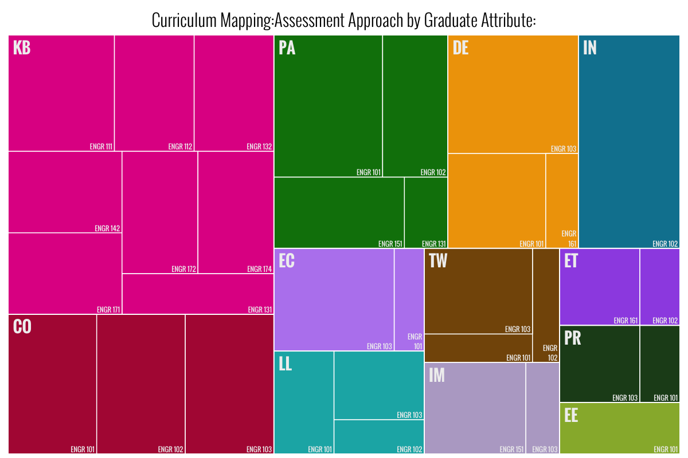

---
output:
  xaringan::moon_reader:
    css: "pres.css"
    seal: FALSE
    nature:
      ratio: '16:9'
      autoplay: FALSE
---

```{r setup, include=FALSE}
options(htmltools.dir.version = FALSE)
library(tidyverse)
library(ggstance)
library(ggalt)
library(ggforce)
library(ggradar)
library(jkmisc)
library(stringr)
library(ggraph)
library(igraph)
library(likert)
library(gridExtra)

load("/Users/Jake/Google Drive/Consulting/TCPS/data/tcps_grad_scales.RData")
load("/Users/Jake/Google Drive/Consulting/TCPS/data/tcps_grad_levers.RData")
```

class: center, middle
layout: false

.title[Visualizing the Teaching Culture Perception Survey]

.pull-right[.author[Jake Kaupp]

.date[`r Sys.Date()`]]

---

class: center, middle, inverse

#.pull-left[An Introduction]

???
About me, my title and the things that I do.

---

class: center, middle

.pull-left[]
.pull-right[]


---
class: center, bottom
background-image: url(images/nsse_slope.png)

---

class: center, bottom
background-image: url(images/nsse_tree.png)

---

class: center, bottom
background-image: url(images/nsse_ls.png)

---

class: center, bottom
background-image: url(images/enrolment.png)

---

class: center, bottom
background-image: url(images/flow.png)

---

class: center, bottom
background-image: url(images/research.png)

---

class: center, bottom
background-image: url(images/dhq.png)

---

class: center, middle, inverse

#.pull-left[Overall Plan for the TCPS]

???

The plan that I have in mind is the devleopment of an interactive application in R.
R is free and the application framework is free for anyone to host. I'll develop the code for the app, and set everything up in a contained package that anyone could load an run.  Or it gets made into a static website, hosted somewhere.

---

class: center, middle, inverse

#What I've done so far...

### Please note that these are very coarse, with zero styling or touchups beyond the minimal

---

class: center, middle

```{r quad, echo = FALSE, out.width = '100%', fig.height = 4}
plot_data <- filter(tcps_grad_levers, faculty == "Queen's") %>% 
  unite(n_stdev, n, std_dev) %>% 
  unite(combo, mean, n_stdev) %>% 
  spread(q_type, combo) %>% 
  separate(Agreement, c("agree_mean","agree_n","agree_sd"), sep = "_") %>% 
  separate(Importance, c("import_mean","import_n","import_sd"), sep = "_") %>% 
  mutate_at(c(6:11), funs(as.numeric)) %>% 
  mutate(size = agree_n/import_n)

ggplot(plot_data, aes(x = agree_mean, y = import_mean)) +
  geom_hline(yintercept = 3, color = "grey50") +
  geom_vline(xintercept = 3, color = "grey50") +
  ggrepel::geom_label_repel(aes(label = stringr::str_wrap(description, 25)), family = "Scope One", segment.colour = "grey50", segment.size = 0.2, size = 3, point.padding = unit(1, "lines")) +
  geom_point(aes(fill = factor(number), size = size), shape = 21, alpha = 0.5) +
  annotate(geom = "label", label = "Agreement", x = 5.5, y = 3.2, fill = "white", label.size = 0, family  = "Oswald-Light", size = 4) +
  annotate(geom = "label", label = "Importance", x = 3.35, y = 0.5, fill = "white", label.size = 0, family  = "Oswald-Light", size = 4) +
  scale_x_continuous(limits = c(0.5,5.5), labels = c("Not at All", "Very Little", "Somewhat", "Quite a Bit", "A Great Deal"), breaks = c(1:5)) +
  scale_y_continuous(limits = c(0.5,5.5), labels = c("Not at All", "Very Little", "Somewhat", "Quite a Bit", "A Great Deal"), breaks = c(1:5)) +
  labs(x = NULL, y = NULL, title = "Quadrant Plot Importance vs Agreement", subtitle = "Dots need to be scaled by % not count") +
  scale_size_area(max_size = 6) +
  scale_fill_brewer(type = "qual", palette = "Set3") +
  theme_jk() +
  theme(panel.grid.minor = element_blank(),
        legend.position = "none")
```

---
```{r sidebars, echo = FALSE, out.width = '100%', fig.height = 4}
plot_data <- filter(tcps_grad_levers, faculty == "Queen's") %>% 
  select(number, q_type, description, mean) %>% 
  mutate(mean = mean - 1) %>% 
  mutate(mean = ifelse(q_type == "Agreement", -mean, mean))

ggplot(plot_data, aes(x = mean, y = description)) +
  geom_barh(stat = "identity", aes(fill = q_type), color = "grey20") +
  geom_vline(xintercept = 0, color = "white", size = 1) +
  scale_x_continuous(limits = c(-4,4), breaks = c(-4,-2,0,2,4), labels = c("A Great Deal", "Somewhat", "Not At All", "Somewhat", "A Great Deal")) +
  expand_limits(y = c(0,7)) +
  scale_fill_manual(values = c("#E74C3C","#3498DB")) +
  annotate(geom = "label", x = -2, y = 6.7, label = "Agreement", color = "#E74C3C", family = "Scope One", size = 4, fill = "white", label.size = 0) +
  annotate(geom = "label", x = 2, y = 6.7, label = "Importance", color = "#3498DB", family = "Scope One", size = 4, fill = "white", label.size = 0) +
  theme_jk(grid = "X") +
  labs(x = NULL, y = NULL, title = "Side-by-Side Barplot") +
  theme(legend.position = "none") 
```

---
```{r polarbars, echo = FALSE, out.width = '100%', fig.height = 4}
plot_data <- filter(tcps_grad_levers, faculty == "Queen's") %>% 
  select(number, q_type, description, mean) %>% 
  mutate(mean = mean - 1) %>% 
  mutate(mean = ifelse(q_type == "Agreement", -mean, mean))

fake_scale <- plot_data %>% 
  mutate(mean = 4) %>% 
  mutate(mean = ifelse(q_type == "Agreement", -mean, mean))

ggplot(plot_data, aes(x = mean, y = description)) +
  geom_barh(stat = "identity", fill = "grey95", color ="white", data = fake_scale, alpha = 0.6) +
  geom_barh(stat = "identity", aes(fill = q_type), color = "white") +
  scale_x_continuous(limits = c(-4,4), breaks = c(-4,-2,0,2,4), labels = c("A Great Deal", "Somewhat", "Not At All", "Somewhat", "A Great Deal")) +
  expand_limits(y = c(0,7)) +
  scale_fill_manual(values = c("#E74C3C","#3498DB")) +
  annotate(geom = "label", x = -3, y = 10, label = "Agreement", color = "#E74C3C", family = "Scope One", size = 5, fill = "white", label.size = 0) +
  annotate(geom = "label", x = 3, y = 10, label = "Importance", color = "#3498DB", family = "Scope One", size = 5, fill = "white", label.size = 0) +
  theme_jk(grid = "X") +
  labs(x = NULL, y = NULL, title = "Polar Bar Chart") +
  theme(legend.position = "none",
        axis.text.y = element_blank()) +
  coord_polar()

```

---
```{r dumbbell, echo = FALSE, out.width = '100%', fig.height = 4}
plot_data <- filter(tcps_grad_levers, faculty == "Queen's") %>% 
  select(number, q_type, description, mean, n) %>% 
  mutate(mean = mean - 1) %>% 
  mutate(mean = ifelse(q_type == "Agreement", -mean, mean)) %>% 
  unite(combo, mean, n) %>% 
  spread(q_type, combo) %>% 
  separate(Agreement, c("agree_mean", "agree_n"), sep = "_")  %>% 
  separate(Importance, c("import_mean", "import_n"), sep = "_") %>% 
  mutate_each(funs(as.numeric), -description)

ggplot(plot_data, aes(y = description)) +
  geom_dumbbell(aes(x = agree_mean, xend = import_mean), dot_guide = TRUE, dot_guide_size = 0.2, colour_x = "#E74C3C", colour_xend = "#3498DB", size = 4, color = "grey30") +
  scale_x_continuous(limits = c(-4,4), breaks = c(-4,-2,0,2,4), labels = c("Quite a bit", "Somewhat", "Not At All", "Somewhat", "Quite a bit")) +
  expand_limits(y = c(0,7)) +
  scale_fill_manual(values = c("#E74C3C","#3498DB")) +
  annotate(geom = "label", x = -2, y = 6.7, label = "Agreement", color = "#E74C3C", family = "Scope One", size = 4, fill = "white", label.size = 0) +
  annotate(geom = "label", x = 2, y = 6.7, label = "Importance", color = "#3498DB", family = "Scope One", size = 4, fill = "white", label.size = 0) +
  theme_jk(grid = "X") +
  labs(x = NULL, y = NULL, title = "Dumbell Plot") +
  theme(legend.position = "none")

```

---
```{r bubs, echo = FALSE, out.width = '100%', fig.height = 6, fig.width = 10}
bubble_data <- filter(tcps_grad_levers, faculty == "Queen's") %>% 
  select(number, q_type, description, mean, n) 

ggplot(bubble_data, aes(x = number, y = mean)) +
  geom_xspline(aes(group = q_type, color = q_type), show.legend = FALSE) +
  geom_point(aes(size = n, fill = q_type), shape = 21, color = "grey20") +
  scale_size_area(max_size = 10) +
  scale_x_continuous(limits = c(0,7), breaks = c(1:6), labels = str_wrap(unique(bubble_data$description), 30)) +
  scale_y_continuous(limits = c(1,5), labels = c("Not at All", "Very Little", "Somewhat", "Quite a Bit", "A Great Deal")) +
  scale_fill_manual(values = c("#E74C3C","#3498DB")) +
  scale_color_manual(values = c("#E74C3C","#3498DB")) +
  labs(x = NULL, y = NULL, title = "Linked Bubble Plot") +
  theme_jk(grid = "Yx") 

```
---
```{r radar, echo = FALSE, fig.height = 5, fig.width = 8}
plot_data <- filter(tcps_grad_levers, faculty == "Queen's") %>% 
  select(number, q_type, mean) %>% 
  spread(number, mean) %>% 
  rename(group = q_type)

ggradar(plot_data, 
        values.radar = c(1,3,5),
        axis.labels = str_wrap(unique(tcps_grad_levers$description),30),
        axis.label.size = 3,
        font.radar = "Oswald-Light", 
        grid.min = 1, 
        gridline.min.colour = "grey50",
        grid.mid = 3,
        gridline.mid.colour = "grey50",
        grid.max = 5,
        gridline.max.colour = "grey50")
```

---
```{r scales, echo = FALSE, out.width = '100%', fig.height = 4}
scales_data <- tcps_grad_scales %>% 
  filter(faculty == "Engineering", number %in% 8:12, type == "Valid", q_type == "Agreement")

lever_data <- tcps_grad_levers %>% 
  filter(item == "Lever", number == 1, faculty == "Engineering", q_type == "Agreement")

summary <- select(scales_data, description, response, n) %>% 
  mutate(n = as.numeric(n)) %>% 
  group_by(description) %>% 
  mutate(percent = n/sum(n)*100) %>% 
  select(-n) %>% 
  spread(response, percent) %>% 
  rename(Item = description) %>% 
  select(Item, one_of(c("Not at All","Very Little","Somewhat","Quite a Bit","A Great Deal")))

result <- likert(summary = as.data.frame(summary)) 
likert <-  plot(result, type = "bar", center = 3) + theme_jk(grid = "Y")

lever_plot <- ggplot(lever_data, aes(x = mean, y = number)) +
  geom_pointrangeh(aes(xmin = mean - std_dev/sqrt(n), xmax = mean + std_dev/sqrt(n))) +
  scale_x_continuous(limits = c(1,5), labels = c("Not at All","Very Little","Somewhat","Quite a Bit","A Great Deal"))  +
  labs(x = NULL, y = NULL, title = sprintf("Lever %s: %s",lever_data$number, unique(lever_data$description))) +
  theme_jk(grid = "X") +
  theme(axis.text.y = element_blank())

grid.arrange(lever_plot, likert, ncol = 1)
```

---

class: center, middle

.stylish_title[Questions?]

---
class: left, middle

#Some questions I have for you!
* What do you mean by "Agreement" and "Importance"?  

* What do you want the most out of the survey, engagement or exploration?  

* Are you looking for artistic representation or more scientific visualizations?  

* Is this a companion piece to a publication, or something that would be a companion to the survey?

