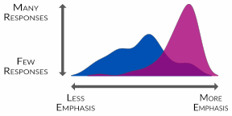

```{r setup, include=FALSE}
library(knitr)
library(tidyverse)
library(tcps)

knitr::opts_chunk$set(echo = FALSE, message = FALSE, warning = FALSE, fig.width = 12, fig.height = 8)

files <- dir(params$path, pattern = "xlsx", full.names = TRUE)

data <- map_df(files, tidy_tcps)

```

# About the Survey

Institutional culture is defined as the embedded patterns, behaviours, shared values, beliefs, and ideologies of an educational institution (Kezar & Eckel, 2002). Institutional culture helps define the nature and reality of an educator or learner’s experience at an educational institution.

The Teaching Culture Perceptions Survey (TCPS) has been developed to provide Canadian universities with a tool to assess instructors’, staff members’, and students’ perceptions of how teaching is valued at their universities. This new survey instrument is designed to document the value that Canadian Universities place on teaching, to provide feedback to universities on their teaching culture, and to monitor changes in that culture over time. The research will validate the institutional teaching culture survey instrument under development, and will help determine areas for improving the perceived teaching culture, which may lead to a more positive teaching environment, and ultimately, improved teaching and learning.

For further information on the TCPS, please go to <https://qualityteachingculture.wordpress.com/>

# Teaching Culture Levers

## Institution Focus

Through our research we have identified 6 levers and related indicators associated with a positive culture of teaching.
 
1. Institutional, strategic initiatives & practices prioritize effective teaching
2. Assessment of teaching is constructive & flexible
3. Implementing effective teaching
4. Infrastructure exists to support teaching
5. Broad engagement around teaching
6. Effective teaching is recognized and rewarded

### Reading Lever Charts
<br>
<div class = "row">
  
<div class = "col-md-6">
<center></center>
</div>

<div class = "col-md-6">
This visualization, called a ridgeline plot, presents a smoothed histogram of <font color = "#0051b3"><b>agreement</b></font> and <font color = "#a70076"><b>importance</b></font> for each Lever. The example on the left, illustrates how to interpret the chart. Examining the two distributions can reveal similarities and differences between the perceptions and priorities of specific groups within an institution.

For instance, in the example, <font color = "#a70076"><b>importance</b></font> illustrates a high degree of emphasis with very little spread, while <font color = "#0051b3"><b>agreement</b></font> shows a wide distribution across lower degrees of emphasis.
</div>
</div>

Below you will find the overall aggregated survey results from the three groups of stakeholders surveyed for the TCPS - instructors, students and staff who directly support teaching and learning.  The levers in the graphic below are ordered by increasing alignment,the difference between agreement and importance. Levers that are out of alignment will appear at the top and levers with a high degree of alignment will appear at the bottom.

```{r institutional_focus}

  tcps_lever_ridgeline(data, name = params$name, pal = pal_one, aggregate = TRUE)

```

## Stakeholder Focus

Three groups of institutional stakeholders have been surveyed for the TCPS - instructors, students and staff who directly support teaching and learning. Below you will find the aggregated survey results for the agreement and importance for each of the 6 levers.

```{r stakeholder_focus}


  tcps_lever_ridgeline(data, name = params$name, pal = pal_one, aggregate = FALSE)

```
  
# Teaching Culture Levers: Drilling Down

In this section we will drill down into each of the levers to review the detailed results of related themes surveyed across stakeholders. Within each lever, you will find results by indicator for each of the three stakeholders surveyed. 
 
### Reading Scale Charts
<br>
<div class = "row">
  
<div class = "col-md-6">
<center></center>
</div>

<div class = "col-md-6">
This stacked bar chart shows the distribution of responses for items within a lever, for agreement and importance, centred on the neutral. This shows the overall trend, as well as the frequency of each category, illustrating the more contentious items. In this example, the top bar shows the skew in the responses towards greater emphasis while bottom bar shows a relatively split distribution. However, we can see that in the bottom bar,the neutral category is largest individual category
</div>
</div>

## Teaching Culture Levers: Institutional, strategic initiatives & practices prioritize effective teaching

The Institutional Initiatives lever identifies indicators of the prioritization of teaching through key documents, activities and initiatives developed to support a positive teaching culture.

Themes include: Teaching is considered a priority by institution and instructors, Effective teaching is defined in institution-wide documents, Institution-wide initiatives exist to promote innovative teaching practice

```{r  lever1, fig.width = 18, fig.height = 12, fig.retina=2, dpi = 200}
  tcps_lever_scale(data, "lever1", name = params$name)
```

## Teaching Culture Levers: Assessment of teaching is constructive & flexible

The Assessment of Teaching lever highlights indicators of the engagement, approach and rigour in the assessment of teaching as a lifelong learning skill.

Themes include: Student evaluations are considered in teaching improvement, hiring, and promotion, Teaching is assessed in multiple ways (dossiers, peer review)

```{r  lever2, fig.width = 18, fig.height = 12, fig.retina=2, dpi = 200}
tcps_lever_scale(data, "lever2", name = params$name)
```
 
## Teaching Culture Levers: Implementing effective teaching

The Implementing Effective Teaching lever highlights indicators of diverse, well-grounded and innovative teaching practices and development.

Themes include: A variety of teaching and learning approaches are used, Teaching and assessment methods align with learning outcomes, Instructors access teaching development opportunities

```{r  lever3, fig.width = 18, fig.height = 12, fig.retina=2, dpi = 200}
tcps_lever_scale(data, "lever3", name = params$name)
```
 
## Teaching Culture Levers: Infrastructure exists to support teaching

The Infrastructure Supporting Teaching lever articulates indicators that focus on access to spaces, resources and funds to support teaching development.

Themes include: Classroom design supports learning, Instructors have access to teaching and learning resources, Instructors can get funds to develop their teaching (grants)
 
```{r  lever4, fig.width = 18, fig.height = 12, fig.retina=2, dpi = 200}
tcps_lever_scale(data, "lever4", name = params$name)
```

## Teaching Culture Levers: Broad engagement around teaching

The Broad Engagement Around Teaching lever articulates indicators that focus on access to learning spaces, resources and funds to support teaching development.

Themes include: Students are involved in teaching-related research & award committees, Teaching assistants support student learning, Collaborative teaching approaches are valued
 
```{r  lever5, fig.width = 18, fig.height = 12, fig.retina=2, dpi = 200}
tcps_lever_scale(data, "lever5", name = params$name)
```

## Teaching Culture Levers: Effective teaching is recognized and rewarded

The Recognizing Effective Teaching lever articulates indicators that focus on the recognition of the importance of effective teaching and its development.

Themes include: Teaching awards exist on campus, Teaching is valued in instructor hiring processes, Teaching accomplishments are celebrated

```{r  lever6, fig.width = 18, fig.height = 12, fig.retina=2, dpi = 200}
tcps_lever_scale(data, "lever6", name = params$name)
```


