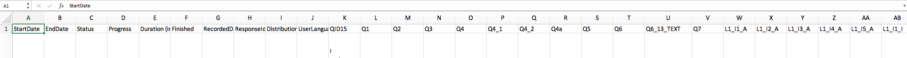

```{r, include = FALSE}
knitr::opts_chunk$set(
  collapse = TRUE,
  comment = "#>"
)
```

```{r setup, include = FALSE}
library(tcps)
```

# About the Survey

Institutional culture is defined as the embedded patterns, behaviours, shared values, beliefs, and ideologies of an educational institution (Kezar & Eckel, 2002). Institutional culture helps define the nature and reality of an educator or learner’s experience at an educational institution.

The Teaching Culture Perceptions Survey (TCPS) has been developed to provide Canadian universities with a tool to assess instructors’, staff members’, and students’ perceptions of how teaching is valued at their universities. This new survey instrument is designed to document the value that Canadian Universities place on teaching, to provide feedback to universities on their teaching culture, and to monitor changes in that culture over time. The research will validate the institutional teaching culture survey instrument under development, and will help determine areas for improving the perceived teaching culture, which may lead to a more positive teaching environment, and ultimately, improved teaching and learning.

For further information on the TCPS, please go to <https://qualityteachingculture.wordpress.com/>

# About the tcps package

During the course of the TCPS, a need to provide some form of reporting and visualization of results was realized.  In the early stages, many visualizations were created using R and the reports constructed in editing software.  This soon matured to a fully fledged R package capable of reading in survey data, calculating the lever scores, visualizing the data and producing a report template for further editing.  Any future development of the TCPS or of this package will be avaiable at <https://qualityteachingculture.wordpress.com/> and at <https://github.com/jkaupp/tcps>

# Using the tcps package

The package is freely available and requires R to be installed as well.  R is a free open-source software available at <https://www.r-project.org/>.  It is a command line program, but there are many high quality and free interactive development enviroments (IDE) one can use. Rstudio <https://www.rstudio.com> is a highly recommended IDE to download and install.

To recap:

1. Download & Install R <https://www.r-project.org/>
2. Download & Install RStudio <https://www.rstudio.com>

# Installing the tcps package

The most straightforward way to install the tcps package is to use the code below:

```{r,eval = FALSE}

if ("devtools" %in% rownames(installed.packages())) {
  devtools::install_github("jkaupp/tcps")
}  else {
  install.packages("devtools")
  
  devtools::install_github("jkaupp/tcps")
}

```

# Before you get started

In order to properly read and process the data across many different survey platforms and potential edits made by institutions some standarized elements needed to be in place.  The questions in the TCPS comprise 6 invidual levers, and each of those questions need to be clearly identified.  To do so this package looks to identify each TCPS question by a unique indentifer, shown below. 


These can either be placed within the survey platform as a question number (qualtrics, survey monkey, survey gizmo) or they can be added as the column header after the data has been exported to an excel file, as shown in the image below.  



Failure to do so will render this program unable to properly determine the items that comprise the levers.  Reading data that is not properly tagged will result in an error, and the functions provided in this package will not work.  

# Reading in your TCPS data with `tcps_read_excel()`

With your properly prepared excel file of exported data from your survey platform of choice, you can use the `tcps_read_excel()` function to read in, tidy and agument your data with the TCPS lever scores.

```{r reading}
library(tcps)

# Load some sample data!
file <- tcps_sample("staff_sample.xlsx")

# With your data the path would be the full file path to the data e.g.
#file <- "PATH/TO YOUR/TCPS Data"

tcps_data <- tcps_read_excel(file)

head(tcps_data)

```


If you have multiple surveys (e.g. student, staff, faculty) in a directory you can read them all using the same command but passing in a list of files.

```{r}
file_list <- tcps_sample(full.names = TRUE)

# On your own machine, you'd use dir("path to directory", full.names = TRUE) to construct a list of files!

all_tcps_data <- tcps_read_excel(file_list)

```


# Visualizing your TCPS Levers with `tcps_lever_ridgeline()`

Now that the excel file has been read into R, you can use some built in functions to visualize the levers and scales using two functions.

`tcps_lever_ridgeline()` is used to visualize the six levers within the TCPS. You can visualize a single lever like this, and get a detailed view of the response distribution in both Agreement and Importance modes of the lever.  The levers are presented with the levers with the largest gaps between agreement and importance at the top (greatest misalignment) and the smallest at the bottom (less misaligned).

### Single/All Levers for a Single Group
```{r rideline, fig.width = 10, fig.height = 5}
tcps_lever_ridgeline(tcps_data, name = "Prestigous Institution", lever = "lever1")
```

You can also visualize all levers at once, not specifying a lever or setting `lever = NULL`.  This does provide a mode homogeneous view of the gaps between agreement and importance across all levers while sacrificing some detail for each individual lever distibution.  

```{r rideline_all, fig.width = 10, fig.height = 5}
tcps_lever_ridgeline(tcps_data, name = "Prestigous Institution")
```

### Single/All Levers for All Groups

You can also visualize the combined surveys data (faculty, staff and student) all on the same chart by passing the full data set.  Similar to before you can use the `lever` argument to visualize a single lever, if you wish. 

```{r rideline_all_groups, fig.width =10, fig.height = 5}
tcps_lever_ridgeline(all_tcps_data, name = "Prestigous Institution")
```

### Single/All Levers by Aggregating Groups

You can set `aggregate = TRUE` in the function to combine the groups to provide an "Institutional View".  Again, you can use the `lever` argument to view a single lever, or leave it blank for all levers.

```{r rideline_institution, fig.width = 10, fig.height = 5}
tcps_lever_ridgeline(all_tcps_data, name = "Prestigous Institution", aggregate = TRUE)
```

### Changing Colors

You can change the color sets in the two distributions using the `pal` argument.  There are three built in options, `pal = pal_one` (default), `pal = pal_two`, `pal = pal_three` or you can specify a two element color vector of your own choosing. 

```{r color, fig.show='hold', fig.align='center', fig.width = 10, fig.height = 5, out.width = "100%"}
tcps_lever_ridgeline(all_tcps_data, name = "Prestigous Institution", aggregate = TRUE, pal = pal_two)
tcps_lever_ridgeline(all_tcps_data, name = "Prestigous Institution", aggregate = TRUE, pal = pal_three)
tcps_lever_ridgeline(all_tcps_data, name = "Prestigous Institution", aggregate = TRUE, pal = c("orange","dodgerblue"))
```

# Visualizing your TCPS Lever Scales with `tcps_lever_scale()`

`tcps_lever_scale()` is used to visualize the distibutions in each question that comprises a lever. The questions are organizd in numeric order starting at the first question in the lever.  Each question shows two bars, the top bar represents importance, the bottom bar represents agreement.  The 5 response categories of each are color coded and centered around the neutral response ("Somewhat").  The numbers on the left and right indicate the percentage of responses of the top two ("Quite a Bit" and "A Great Deal") and bottom two ("Very Little" and "Not At All") categories.  This provides the item by item distribution view, highlighting the high response options and illustrating how indiviudal scale skew can affect the lever distribution.

### Single Lever for a Single Group

Due to space requirements you can only visualize a single lever at a time.

```{r scale1, fig.width = 8, fig.height = 8}
tcps_lever_scale(tcps_data, choice =  "lever1", name = "Prestigous Institution")
```

### Single Lever for a Single Group

Simply plotting combined data and specifying a lever will plot the scale items for each lever side by side.  Note that the lever scale questions differ between groups.

```{r scale2, fig.width = 12, fig.height = 8, out.width="100%"}
tcps_lever_scale(all_tcps_data, "lever2", name = "Prestigous Institution")
```

# Reporting on your TCPS data

You can use the visualization to construct your own report by various methods.  You can:

1. Save them as images to use outside of R (e.g. microsoft word)
2. Investigate the `rmarkdown` package to write reports in R.
3. Use the handy `tcps_report()` function to produce a boilerplate report in html, pdf or word.

```{r report, eval = FALSE}

path <- dirname(tcps_sample("faculty_sample.xlsx", full.names = TRUE))

tcps_report(path_to_data = path, name_of_school = "Prestigous Institution", format = "word")

```

# Bugs and Fixes

If you notice a bug or an error, please submit an issue at https://github.com/jkaupp/tcps/issues

# Future Plans

Currently there are no plans for further development.  However, this being an open source package there will be maintenance to fix any breaking changes.  Additionally, I welcome anyone willing to expand the functionality of the package by submitting a pull request on github (http://www.github.com/jkaupp/tcps).


